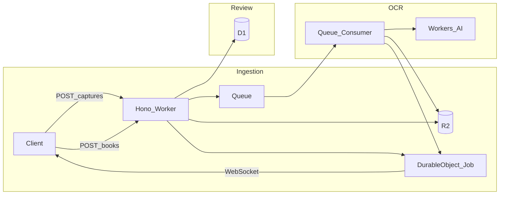

## 全体アーキテクチャ（実装に即した流れ）

- **1 Worker エントリ**で `fetch`（Hono）と `queue`（コンシューマ）の両方を扱うのが一般的（[`wrangler` の `[[queues.consumers]]` と同じ `main`】）。
- **ジョブ単位**は `crypto.randomUUID()` 等で生成し、R2 キー・Queue メッセージ・DO インスタンス ID（[Durable Object `idFromString`](https://developers.cloudflare.com/durable-objects/api/stub/)）に一貫して紐づける。

## データ・契約（実装前に型で固定）

| 項目             | 方針                                                                                                                                                                                                  |
| ---------------- | ----------------------------------------------------------------------------------------------------------------------------------------------------------------------------------------------------- |
| ジョブ状態       | `pending` → `processing` → `done` \| `error`                                                                                                                                                          |
| `POST /captures` | `multipart/form-data`（例: フィールド名 `file`）または生画像＋`Content-Type` 明示のどちらか一方に決め打ち（Hono では `multipart` が扱いやすい）                                                       |
| `POST /books`    | 承認済みメタデータ＋`jobId`（OCR ジョブとのリンク）。D1 保存カラムは最小例: `id`, `job_id`, `title`, `author`, `isbn`（null 可）, `created_at` 等 — **実装時に 1 マイグレーションファイルにまとめる** |
| WebSocket        | 例: `GET /jobs/:jobId/ws` で `Upgrade` を **該当 DO にプロキシ**（ジョブ完了時に DO が接続中クライアントへブロードキャスト）。Hibernation API は第1段は任意（まずは動作優先）                         |

OCR については、Workers AI の **Image-to-Text / Vision** 系（例: 公式カタログの `@cf/...` モデル。実装前に [Workers AI models](https://developers.cloudflare.com/workers-ai/models/) で **Image-to-Text** またはマルチモーダルに画像入力できるモデル**を1本選定**し、`env.AI.run(MODEL, input)` で「抽出テキスト or 本の欄用にプロンプトで structured な平文」に揃える。画像サイズは Workers AI の制限に合わせ、必要なら **サーバー側で縮小**（第5タスク内で扱う）。

## PR / タスク分割（変更規模の目安）

各ターゲットは **おおむね 1 PR = 1 レビュー単位**（想定差分: 小〜中）。順序に依存。

### タスク1 — スキャフォルドと Hono の土台

- `package.json` / `tsconfig` / `wrangler.toml`（または `wrangler.json`）
- エントリ: Hono `app` を `export default { fetch: app.fetch } satisfies ExportedHandler<Env>` 形式に
- ルート例: `GET /health` のみ
- `Env` 型は空またはプレースホルダ（次タスクで拡張）
- **変更規模**: 新規ファイル中心・バインディング未接続

### タスク2 — Durable Object: ジョブ状態＋ `GET /jobs/:jobId`

- DO クラス: ジョブの作成（`add`）、OCR 後の**結果テキスト・エラー**の更新、状態遷移
- Hono: `GET /jobs/:jobId` で **該当 DO の `fetch` にルーティング**するか、DO 内で JSON を返す HTTP パスを定義
- `wrangler` に `durable_objects.bindings` と `migrations` を追加
- **目的**: Queues/AI なしで「ジョブの読み取り」が通る
- **変更規模**: DO 1 クラス＋小さな Hono 追加（数十〜100行前後想定）

### タスク3 — WebSocket（第1段・ユーザー要望）

- 同一 DO（または専用ルート）で `WebSocket` ペアを受け入れ、ステータスが `done`/`error` になったら **接続中クライアントへ通知**
- クライアントの接続手順: `GET /jobs/:jobId/ws`（Hono から `stub.fetch` へ中継が定石）
- タスク2 の GET と併用（デバッグ用に REST 残すのがおすすめ）
- **変更規模**: DO 内＋Hono 1 ルート。Hibernation は省略可なら第2イテレーションに回して差分を抑える

### タスク4 — R2 ＋ `POST /captures`

- R2 バインディング、`put` で画像保存、キー例: `captures/{jobId}/{...}`
- フロー: 画像受信 → `jobId` 生成 → DO に `pending` 登録 → R2 保存（順序は「先 DO で ID 確定」が安全）
- レスポンス: `{ jobId }` のみ or R2 キーを含む簡易 JSON
- **まだ** Queue 送信は入れない**または**、次タスクで入れるなら **キュー用メッセージ型だけ** 先に `src/types/queue.ts` で定義しておく
- **変更規模**: 中（マルチパートパース＋R2＋既存 DO 呼び出し）

### タスク5 — Queues: プロデューサー＋コンシューマの骨格

- `[[queues.producers]]` / `[[queues.consumers]]`、メッセージ: `{ jobId, r2Key }` 等
- `POST /captures` 末尾で `send`（必ず DO 登録と R2 成功後）
- コンシューマ: `message` 受信 → ログまたは no-op まで（AI は次タスク）
- **変更規模**: 小〜中（`wrangler` 追記＋`queue` ハンドラ）

### タスク6 — Workers AI による OCR＋ DO 更新

- R2 から `get` して `ArrayBuffer` / `Uint8Array`（モデル入出力仕様に合わせる）
- `env.AI.run(選定モデル, ...)` 実行
- 成功時: DO の `updateJobResult` 相当。失敗時: `error` 状態
- 完了で **WebSocket 購読者に通知**（タスク3 のパスに接続）
- **変更規模**: 中（エラーハンドリングとサイズ制限の扱い含む）

### タスク7 — D1 ＋ `POST /books`

- `migrations` でスキーマ 1 本、バインディング `DB`
- `POST /books`: JSON で承認内容を受け、**ジョブが `done` であること**等の最小バリデーションの後 `INSERT`
- 認証は README に無いため **第1段はオプト（API トークン等）はスコープ外**と明記可能（入れるなら別小 PR）
- **変更規模**: 中（スキーマ＋1 エンドポイント＋型）

## 補足

- **フロントエンド**（カメラ・承認 UI）は図上あるが、本計画の API ＋ WebSocket 契約が先。静的サイトは同リポの `public/` や別 PR でよい。
- **ローカル検証**: `wrangler dev` で R2/Queues/DO/AI/D1 の一部は**リモートバインディング**が必要な場合あり。各タスクの README 追記は**ユーザー依頼時**に 1 回にまとめる形がよい（ルール: 依頼のない .md 大量追加は避ける）。

## 主要リスク

| リスク                      | 緩和                                                              |
| --------------------------- | ----------------------------------------------------------------- |
| Workers AI モデル入出力差異 | タスク6 前に 1 モデルに固定し、小さな `runOcr(env, bytes)` に隔離 |
| 画像が大きすぎる            | R2 保存後、AI 前にリサイズ／品質下げ（必要時のみ）                |
| DO と Queue の順序          | 先に `jobId` と DO 登録、失敗時はキューに入れない                 |

---

以上の順で実装すれば、各 PR は**単一責任**（土台 → DO+読み取り → WS → 取り込み → キュー → AI → 永続化）に収まり、レビューしやすい差分に分割できる。
